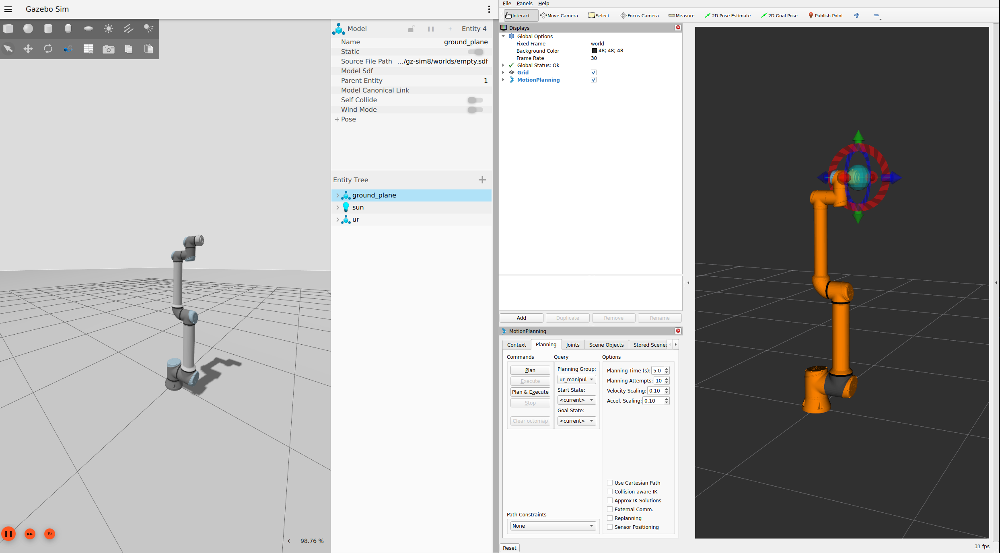
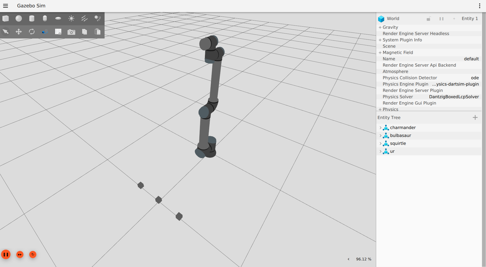

ur_simulation_gz
================

This package contains configurations and example files for Gazebo simulation of Universal Robots manipulators.

Structure of the repository
---------------------------

To set up the simulation the used files are:

- ``urdf/ur_gz.ros2_control.xacro`` - macro for ros2_control configuration, defining the initial joint positions and the hardware interface plugin for the simulation
- ``urdf/ur_gz.urdf.xacro`` - main file that contains the robot description, defines reference for the Gazebo world and initializes ros2_control Gazebo plugin.

Usage
-----

To launch the simulation, two files can be used:

- ``launch/ur_sim_control.launch.py``
- ``launch/ur_sim_moveit.launch.py``

They both start Gazebo, but only the second launches MoveIt! together with it, allowing to plan motions using either MoveGroup interfaces or the Motion Planning panel in Rviz.

So, if only Gazebo and Rviz are needed:

.. code-block:: console

   $ ros2 launch ur_simulation_gz ur_sim_control.launch.py ur_type:=ur10e

If we also want to be able to use MoveIt!, then:

.. code-block:: console

    $ ros2 launch ur_simulation_gz ur_sim_moveit.launch.py ur_type:=ur10e

**Note**: all the additional launch arguments are described in the launch files themselves.

Customization
-------------

Beyond the default usage, the package offers some customization options:

- Custom description
- tf_prefix
- Custom world

The first option is easily achievable by using the launch argument ``description_file``,  which allows to pass the absolute path of a custom description to both launchers. Together with it, it could be useful to choose a custom Rviz configuration file and the launch argument ``rviz_config_file`` can be passed for that. An example of their usage:

.. code-block:: console

   $ ros2 launch ur_simulation_gz ur_sim_control.launch.py ur_type:=ur10e description_file:="/home/ubuntu/ur_gz_test.urdf.xacro" rviz_config_file:="/home/ubuntu/rviz_test.rviz"

Also here, like in the driver package, it is possible to specify tf_prefix using the ``tf_prefix`` launch argument, but for this package this is not the only step required. Since controllers loading is handled differently, it is necessary to define a custom controllers file with the desired tf_prefix. Assuming ``tf_prefix:="alice_"``, an example of such file could be:

.. code-block:: yaml

  controller_manager:
  ros__parameters:
    update_rate: 500  # Hz

    joint_state_broadcaster:
      type: joint_state_broadcaster/JointStateBroadcaster

    io_and_status_controller:
      type: ur_controllers/GPIOController

    speed_scaling_state_broadcaster:
      type: ur_controllers/SpeedScalingStateBroadcaster

    force_torque_sensor_broadcaster:
      type: ur_controllers/ForceTorqueStateBroadcaster

    joint_trajectory_controller:
      type: joint_trajectory_controller/JointTrajectoryController

    scaled_joint_trajectory_controller:
      type: ur_controllers/ScaledJointTrajectoryController

    forward_velocity_controller:
      type: velocity_controllers/JointGroupVelocityController

    forward_position_controller:
      type: position_controllers/JointGroupPositionController

    speed_scaling_state_broadcaster:
      ros__parameters:
        state_publish_rate: 100.0

    force_torque_sensor_broadcaster:
      ros__parameters:
        sensor_name: tcp_fts_sensor
        state_interface_names:
          - force.x
          - force.y
          - force.z
          - torque.x
          - torque.y
          - torque.z
        frame_id: tool0
        topic_name: ft_data

    joint_trajectory_controller:
      ros__parameters:
        joints:
          - alice_shoulder_pan_joint
          - alice_shoulder_lift_joint
          - alice_elbow_joint
          - alice_wrist_1_joint
          - alice_wrist_2_joint
          - alice_wrist_3_joint
        command_interfaces:
          - position
        state_interfaces:
          - position
          - velocity
        state_publish_rate: 100.0
        action_monitor_rate: 20.0
        allow_partial_joints_goal: false
        constraints:
          stopped_velocity_tolerance: 0.2
          goal_time: 0.0
          shoulder_pan_joint: { trajectory: 0.2, goal: 0.1 }
          shoulder_lift_joint: { trajectory: 0.2, goal: 0.1 }
          elbow_joint: { trajectory: 0.2, goal: 0.1 }
          wrist_1_joint: { trajectory: 0.2, goal: 0.1 }
          wrist_2_joint: { trajectory: 0.2, goal: 0.1 }
          wrist_3_joint: { trajectory: 0.2, goal: 0.1 }

    scaled_joint_trajectory_controller:
      ros__parameters:
        joints:
          - alice_shoulder_pan_joint
          - alice_shoulder_lift_joint
          - alice_elbow_joint
          - alice_wrist_1_joint
          - alice_wrist_2_joint
          - alice_wrist_3_joint
        command_interfaces:
          - position
        state_interfaces:
          - position
          - velocity
        state_publish_rate: 100.0
        action_monitor_rate: 20.0
        allow_partial_joints_goal: false
        constraints:
          stopped_velocity_tolerance: 0.2
          goal_time: 0.0
          shoulder_pan_joint: { trajectory: 0.2, goal: 0.1 }
          shoulder_lift_joint: { trajectory: 0.2, goal: 0.1 }
          elbow_joint: { trajectory: 0.2, goal: 0.1 }
          wrist_1_joint: { trajectory: 0.2, goal: 0.1 }
          wrist_2_joint: { trajectory: 0.2, goal: 0.1 }
          wrist_3_joint: { trajectory: 0.2, goal: 0.1 }

    forward_velocity_controller:
      ros__parameters:
        joints:
          - alice_shoulder_pan_joint
          - alice_shoulder_lift_joint
          - alice_elbow_joint
          - alice_wrist_1_joint
          - alice_wrist_2_joint
          - alice_wrist_3_joint
        interface_name: velocity

    forward_position_controller:
      ros__parameters:
        joints:
          - alice_shoulder_pan_joint
          - alice_shoulder_lift_joint
          - alice_elbow_joint
          - alice_wrist_1_joint
          - alice_wrist_2_joint
          - alice_wrist_3_joint

To load the newly defined file, it is possible to specify its absolute path with the ``controllers_file`` argument. Together with it the desired prefix should be also be specified as argument, like in the following example:

.. code-block:: console

   $ ros2 launch ur_simulation_gz ur_sim_control.launch.py ur_type:=ur10e tf_prefix:="alice_" controllers_file:="/home/ubuntu/ur_controllers_test.yaml"

.. note:: 

   The ``tf_prefix`` argument is not available for ``ur_sim_moveit.launch.py``, since it would require a custom definition of the moveit config package for properly setting it up.

The last customization option allows to instantiate the robot in a proper setup instead of an empty world, like the given launch files do by default. The first step to create a complete simulation is to define a world file (.sdf): for this example we can create a simple custom world ``test_world.sdf`` and place it in ``ur_gz_simulation/worlds``. For more details about building worlds in Gazebo, it's possible to check the `related tutorial <https://gazebosim.org/docs/harmonic/sdf_worlds>`_.
To use the new world changes are minimimal:

- in ``ur_sim_control.launch.py`` we can add the path to the ``launch_setup`` as

.. code-block:: python

    world_file_path = PathJoinSubstitution(
        [FindPackageShare("ur_simulation_gz"), "worlds", "test_world.sdf"]
    )

- and then modify the ``gz_launch_description`` in order to use the desired world file:

.. code-block:: python

   gz_launch_description = IncludeLaunchDescription(
        PythonLaunchDescriptionSource(
            [FindPackageShare("ros_gz_sim"), "/launch/gz_sim.launch.py"]
        ),
        launch_arguments={
            "gz_args": IfElseSubstitution(
                gazebo_gui, if_value=[" -r -v 4 ", world_file_path], else_value=[" -s -r -v 4 ", world_file_path]
            )
        }.items(),
    )

With these changes, when launching the simulation with one of the commands shown before, Gazebo will use the indicated custom world instead of the default empty, like in the following picture.

